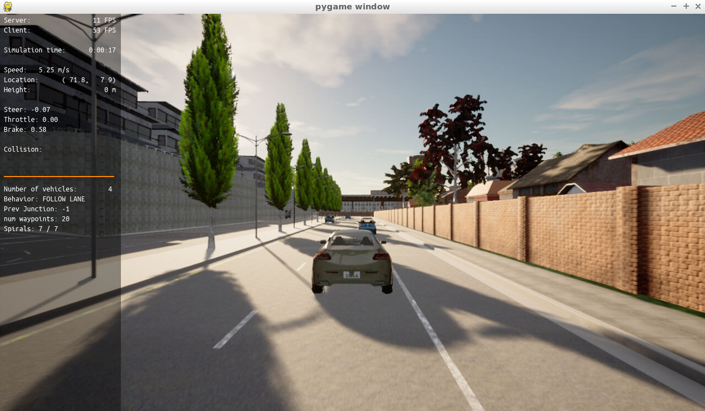
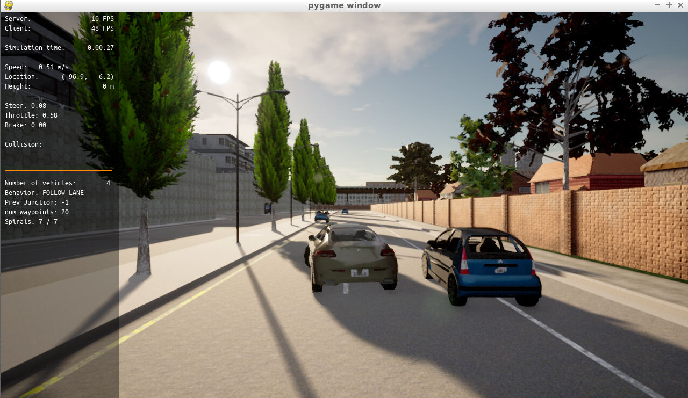
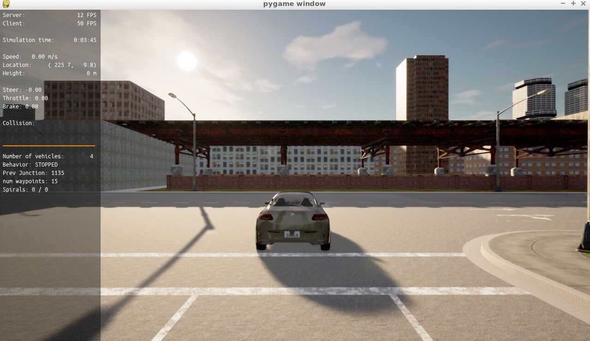
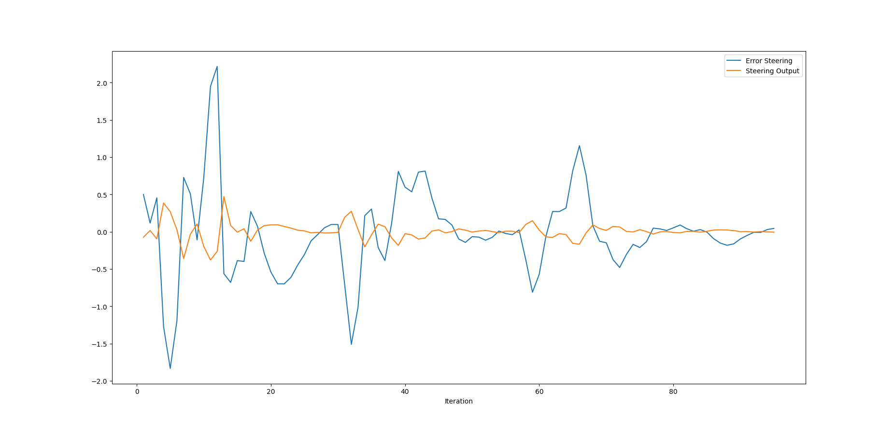
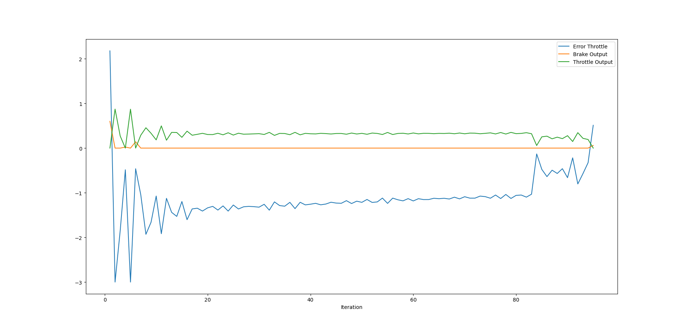

# Overview
Apply PID controller to predefined behavior and path planner to control simulated vehicle in Carla.

# PID controller implementation
2 separated PID controllers are used: one for steering control and one for throttle control:
- **Steering controller** uses the differences between current y_position and the y_position of the first point of the desire trajectory as steer error.
- **Throttle controller** uses the differences between current velocity and velocity of the last point of the desire trajectory as throttle error. If throttle output is positive, throttle will be enabled while brake will be disabled to accelerate the vehicle. Whereas, if throttle output is negative, throttle will be disabled while brake will be enabled to decelerate the vehicle.

Below files are modified to implement PID controller:
- **pid_controller.h**: define PID variables that are used when calculating error and control signal
- **pid_controller.cpp**: implement PID controller: initialize variables, calculate error and control signal
- **main.cpp**: create PID controller objects, set PID parameters, assign error value and retrieve control signal of each controller.

# Run scripts to evaluate PID controller
## Run Carla Simulator
**run_carla.sh** script was created to make running Carla easier (must run `su - student` first). It just contains commands from the project instruction:
```
$ ./run_carla.sh
```
## Run the controller
**run_main_pid.sh** was modified to pass console arguments to PID parameters. If no argument is provided, the controllers use predefined values. If 6 arguments are provided, they are used as PID parameters:
```
$ ./run_main_pid.sh <steer_kP> <steer_kI> <steer_kD> <throttle_kP> <throttle_kI> <throttle_kD>
```

# Results
Below are screenshots captured during experimenting PID controller. There may be issues in the planner and/or Carla interaction code (not TODO part) that make planed trajectories are not shown in the **pygame** window.

Vehicle at start position


Vehicle when overtaking


Vehicle at stop position



# Answer questions
## Steer and Throttle plots





Control outputs are in opposite direction with signal errors. This is because the controller want to minimize the defined errors. Control magnitudes are much less than errors because Proportional values (kP) are less than 1.

## Effect of PID parameters
Each part of the PID affects the control command in different ways:
- Proportional term (kP) will correct current error, I used small values of kP to reduce oscillation
- Integral term (kI) will correct residual error over time and avoid system bias. However, I used very small kI values so they are not clearly depicted in the plots.
- Derivative term (kD) helps to reduce overshooting by damping the rate of error change. In the plots, kD help to stabilize control signals.

## Automatically tune PID parameters
Twiddle algorithm could be used to optimize PID parameters by iterating on a set of control parameter: making incremental changes when an improvement is detected and reduce the magnitude of the changes when there is no better output value.

In this project, we could use mean absolute values of steer error and throttle error from start position to stop position as evaluation function.

## Pros and Cons of PID (a model free controller)
- Pros: simple and could be applied for many different control problems without modifications. Require small computing footprint to calculate control outputs makes it suitable for realtime systems.
- Cons: has very limited number of parameters so that finding a good combination may not always possible. In addition, PID does NOT leverage domain specific knowledge to optimize the control performance such as vehicle physical characteristics (vehicle model, friction properties, etc.)

## (Optional) Improve PID controller
We could improve the PID controller by:
- Reduce control cycle time (delta t). Working cycle with duration 1 second is too big for controlling vehicle.
- Choose different parameter values for different cases such as accelerate, brake, overtake, etc.)
- Compensate current acceleration and current direction when calculating control signals.
